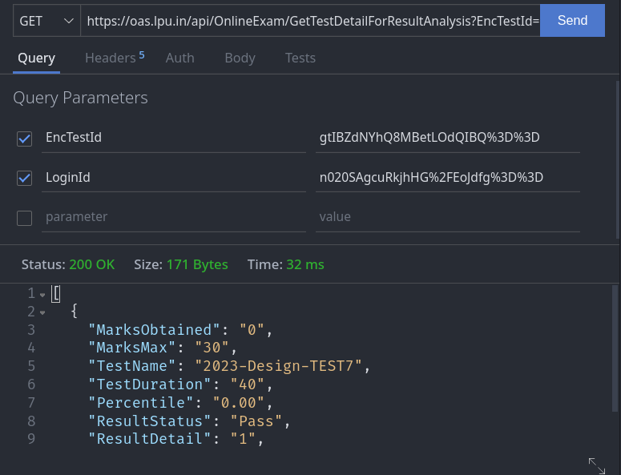
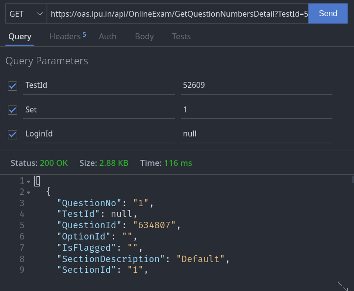
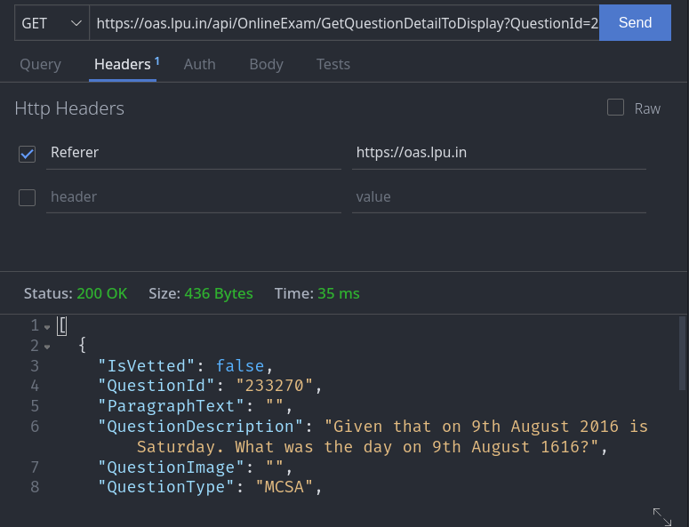
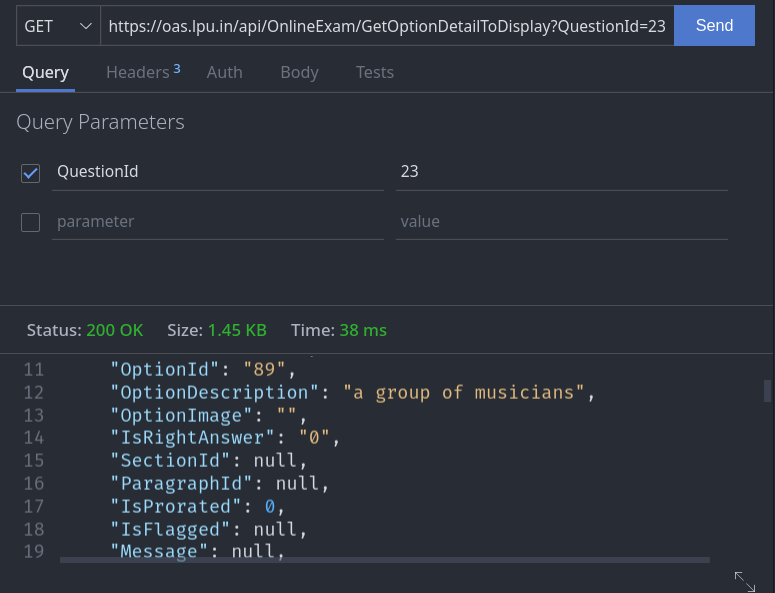

# Profanity - An Inclusive Exploit

[](https://github.com/0x0is1/profanity/actions/workflows/webpack.yml)
[](https://saythanks.io/to/0x0is1off@gmail.com)


This repository contains exploit for bug in Authetication and API Access of the affected platform. This exploit has been released without the original vendor's prior knowledege as of now.

# Affected Modules
The result (`single and multiple both`), which has not been published yet, The questions available on the platform, can be accessed without user authetication just by proper API calling.

## Result section
After analyzing and modifying API callings, it has been acknowledged that Data can be accessed without authetication which is (here) two kind of tokens
- Marks access POC



As you can see there are no other authetication than formal headers and encrypted registration number. (The encryption backtracking was possible just by taking a look in query file).

## Complete Section Result section
Same as previous can be access for whole bunch of registration numbers, while in the exploit, getting accessed through Vendor's chat API (another platform API of the same vendor) and writing into a Excel file.

## Test paper section
All questions and their options is accessible regardless of user's interest or not, just by question id.

- Questions Sequence detail Access POC



- Question Access POC



- Option Access POC  (and hence complete test paper is accessible)



## Answer access and auto-attempt

Answers can be obtained by continuous marks tracking along with change in option.
This will lead to accurate correct option access.
This will also lead to auto-attempt paper for the provided user, but we may skip this step by using random registration numbers.

Commits responsible- [`e4ae17d`](https://github.com/0x0is1/profanity/commit/0dbab9e9d6697204902bfecf7a61fbf84e4ae17d) [`ab57467`](https://github.com/0x0is1/profanity/commit/03306df204f1ad69747267efae92f54c8ab57467) [`4ddd0de`](https://github.com/0x0is1/profanity/commit/ed0ffa1c461cca8874ca7d100b1e9301c4ddd0de)

# Suggested FIX
A valid authetication of API with mock access tokens being used, can save all these leaks.

# Usage

## Requirements
- [node-js](https://nodejs.org/en/download/)
- [git](https://git-scm.com/downloads)
- node-fetch (`2.6.1`) **same version important**
- prompt-sync (`4.2.0`)
- xlsx (`0.18.5`)
- uuid (`9.0.0`)
## Installation
### Windows (cmd or powershell)
```sh
$ winget install -e --id OpenJS.NodeJS
$ winget install -e --id Git.Git
$ git clone https://github.com/0x0is1/profanity.git
$ cd profanity
$ npm install
```

### Linux (terminal)
```sh
$ sudo apt-get install nodejs git -y
$ git clone https://github.com/0x0is1/profanity.git
$ cd profanity
$ npm install
```

### MacOS (terminal)
```sh
$ brew install node git
$ git clone https://github.com/0x0is1/profanity.git
$ cd profanity
$ npm install
```

## Use case

```sh
# for single result
## no authentication required
$ npm run result

# for whole section
## authetication required for whole section registration number access
$ npm run export

# for questions
## no authetication required
$ npm run question

# for answers
## no authentication required
$ npm run answer
```

# Disclaimer
We do not promote any harmful usage of this exploit. This is just a proof of concept being proposed to the vendor. If vendor has any conflict regarding this repository, we will remove it. You may contact us through our [mail](mailto://0x0is1@protonmail.com).

### **Support authors**:
We are group of indie developers and testers, working for open source. Your tiny help can boost us to provide more good works for everyone for free.
Thank you.

[](https://www.buymeacoffee.com/6dciIwk)

[](https://paypal.me/0x0is1?locale.x=en_GB)
